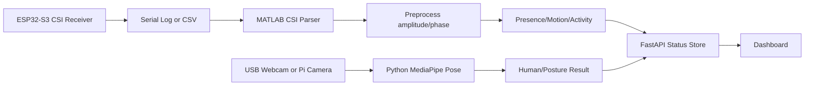

# 시스템 아키텍처

## 전체 흐름

## 설계 원칙
- CSI와 카메라 모듈은 독립 실행 가능해야 한다.
- 실제 하드웨어가 없어도 mock data로 발표 흐름을 재현한다.
- 카메라 pose는 CSI 모델의 정답이 아니라 비교 기준 또는 보조 ground-truth로 사용한다.
- 외부 API key, LLM 연동, 서버 자동화는 본 구현에서 제외하고 확장 문서로 분리한다.

## 데이터 인터페이스
- CSI 결과: `presence`, `motion`, `activity`, `confidence`, `timestamp`
- Pose 결과: `human`, `posture`, `avg_confidence`, `num_valid_keypoints`, `timestamp`
- 통합 상태: API 서버 메모리 저장소에서 최신 두 결과를 합쳐 반환한다.

